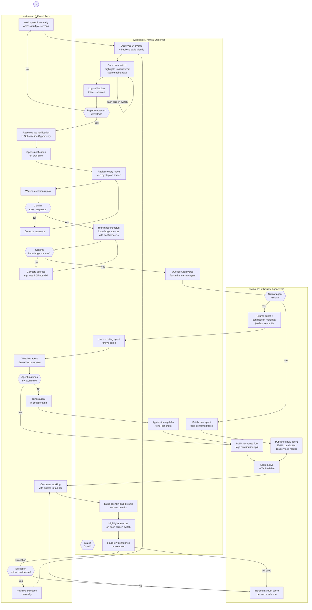

# r4mi-ai — Claude Code Build Instructions

## What This System Is

r4mi-ai is a **UI workflow observation and automation factory**. It watches human workers use existing software (in this case: a municipal permit processing system built on Chatwoot), silently detects repetitive patterns, then helps the worker collaboratively build, tune, and publish narrow AI agents that progressively take over their repetitive work.

The key properties of the system:

- **Workers never stop working** — the system observes passively and surfaces opportunities in a non-blocking tab
- **No automatic approvals** — the expert always confirms action sequences and knowledge sources before anything is published
- **Agent market with trust lifecycle** — agents start supervised, earn autonomy through successful runs, and deprecate when stale
- **Contribution tracking** — when an existing agent from another user is tuned and forked, contribution scores are split by code delta

-----

## System Architecture

```
┌─────────────────────────────────────────────────────────────┐
│                    FRONTEND (React 19 + Vite)               │
│  Chatwoot-embedded sidebar  │  Tab progression bar          │
│  Source highlight overlay   │  Agent demo playback          │
└───────────────┬────────────────────────────┬────────────────┘
                │ WebSocket (AG-UI SSE)       │ REST
┌───────────────▼────────────────────────────▼────────────────┐
│                  BACKEND (FastAPI 0.133.1)                   │
│  /observe   — receives UI event stream from browser ext     │
│  /patterns  — pattern detection state machine               │
│  /agents    — agent market CRUD + trust scoring             │
│  /session   — replay + confirmation flow                    │
│  /sse       — server-sent events to frontend                │
└───────────────┬─────────────────────────────────────────────┘
                │
┌───────────────▼─────────────────────────────────────────────┐
│               AI LAYER (google-adk + google-genai)          │
│  ObserverAgent    — watches event stream, extracts patterns  │
│  SpecBuilderAgent — converts confirmed trace → agent spec   │
│  MarketMatcher    — semantic search over agentverse         │
│  NarrowAgent      — executes a published workflow spec      │
└─────────────────────────────────────────────────────────────┘
```

-----

## Package Versions (Confirmed Latest — Feb 27, 2026)

### Python Backend

```
python>=3.12
fastapi==0.133.1
uvicorn[standard]==0.34.0
google-genai>=1.0.0          # New unified SDK — NOT google-generativeai (legacy)
google-adk>=1.0.0            # Agent Development Kit, bi-weekly releases
pydantic>=2.12.0
python-dotenv>=1.0.0
sse-starlette>=2.1.0
sqlmodel>=0.0.21             # SQLite persistence for agent market
httpx>=0.28.0
pytest>=8.3.0
pytest-asyncio>=0.25.0
```

### Frontend

```json
{
  "react": "^19.2.4",
  "typescript": "^5.9.3",
  "vite": "^7.3.1",
  "@vitejs/plugin-react": "^5.1.4",
  "tailwindcss": "^4.2.1",
  "shadcn-ui": "latest",
  "zustand": "^5.0.11",
  "@tanstack/react-query": "^5.90.21",
  "mermaid": "^11.12.3"
}
```

### Key SDK Notes

- Use `from google import genai` — **not** `import google.generativeai`
- Default model: `gemini-2.5-flash`
- ADK agent pattern: `from google.adk.agents import Agent`
- ADK requires Python 3.10+ — use 3.12

-----

## System Diagram (UML Activity — 3 Swimlanes)

This diagram must be rendered in the frontend using Mermaid. Include it at `/frontend/src/assets/system-diagram.mermaid`.



-----

## Project Structure

```
r4mi-ai/
├── CLAUDE.md                        ← this file
├── docker-compose.yml
├── .env.example
│
├── backend/
│   ├── main.py                      ← FastAPI app entrypoint
│   ├── requirements.txt
│   ├── agents/
│   │   ├── observer_agent.py        ← ADK agent: watches UI event stream
│   │   ├── spec_builder_agent.py    ← ADK agent: trace → spec
│   │   ├── market_matcher.py        ← semantic similarity search over agentverse
│   │   └── narrow_agent.py         ← ADK agent: executes a published spec
│   ├── routers/
│   │   ├── observe.py               ← POST /observe — receives browser events
│   │   ├── patterns.py              ← GET /patterns — state machine status
│   │   ├── agents.py                ← CRUD for agent market
│   │   ├── session.py               ← replay, confirmation, tuning endpoints
│   │   └── sse.py                   ← SSE stream to frontend
│   ├── models/
│   │   ├── event.py                 ← UIEvent, ActionTrace, KnowledgeSource
│   │   ├── agent_spec.py            ← NarrowAgentSpec, TrustLevel, Contribution
│   │   └── session.py               ← ObservationSession, ReplayFrame
│   ├── services/
│   │   ├── pattern_detector.py      ← 10-stage state machine
│   │   ├── trust_engine.py          ← supervised → autonomous promotion logic
│   │   ├── contribution_tracker.py  ← code delta → attribution split
│   │   └── knowledge_extractor.py   ← unstructured source identification + confidence
│   └── db.py                        ← SQLModel + SQLite setup
│
├── frontend/
│   ├── src/
│   │   ├── main.tsx
│   │   ├── App.tsx
│   │   ├── assets/
│   │   │   └── system-diagram.mermaid   ← embed the UML diagram above
│   │   ├── components/
│   │   │   ├── TabProgressionBar.tsx    ← persistent agent task bar at bottom
│   │   │   ├── OptimizationTab.tsx      ← non-blocking notification tab
│   │   │   ├── SessionReplay.tsx        ← step-by-step replay of user actions
│   │   │   ├── SourceHighlight.tsx      ← overlay that highlights unstructured sources
│   │   │   ├── AgentDemo.tsx            ← live agent execution demo on screen
│   │   │   ├── TuningPanel.tsx          ← collaborative tuning with diff view
│   │   │   ├── AgentMarket.tsx          ← browse agentverse, see trust/contributions
│   │   │   └── SystemDiagram.tsx        ← renders system-diagram.mermaid via mermaid.js
│   │   ├── hooks/
│   │   │   ├── useSSE.ts               ← connects to /sse, drives UI updates
│   │   │   ├── useAgentMarket.ts
│   │   │   └── useReplay.ts
│   │   └── store/
│   │       └── r4mi.store.ts           ← Zustand global state
│   ├── package.json
│   └── vite.config.ts
│
└── chatwoot/
    └── docker-compose.yml            ← Chatwoot instance for demo environment
```

-----

## Core Data Models

### UIEvent (what the browser extension sends)

```python
class UIEvent(BaseModel):
    session_id: str
    user_id: str
    timestamp: datetime
    event_type: str          # "click" | "navigate" | "input" | "screen_switch"
    screen_name: str         # e.g. "GIS_SYSTEM" | "CODE_ENFORCEMENT" | "POLICY_WIKI"
    element_selector: str
    element_value: Optional[str]
    backend_call: Optional[dict]    # captured XHR/fetch payload
    screenshot_b64: Optional[str]   # for Gemini Vision analysis
```

### NarrowAgentSpec (what gets published to the market)

```python
class TrustLevel(str, Enum):
    SUPERVISED = "supervised"
    AUTONOMOUS = "autonomous"
    STALE = "stale"

class Contribution(BaseModel):
    user_id: str
    score: float             # 0.0–1.0, proportional to code delta

class NarrowAgentSpec(SQLModel, table=True):
    id: str = Field(default_factory=lambda: str(uuid4()))
    name: str
    description: str
    trigger_pattern: dict    # what pattern activates this agent
    action_sequence: list    # ordered list of UI actions to replay
    knowledge_sources: list  # list of {screen, selector, confidence}
    trust_level: TrustLevel = TrustLevel.SUPERVISED
    successful_runs: int = 0
    failed_runs: int = 0
    contributions: list[Contribution] = []
    created_at: datetime
    updated_at: datetime
```

-----

## Key Behaviours to Implement

### 1. Passive Observation (ObserverAgent)

- Browser extension streams `UIEvent` objects to `POST /observe`
- ObserverAgent uses Gemini Vision on screenshots to identify unstructured text regions
- Pattern detector runs a 10-stage state machine to identify repetition across sessions
- When pattern confidence > threshold: emit SSE event `OPTIMIZATION_OPPORTUNITY` to frontend

### 2. Optimization Tab (Non-blocking)

- Tab appears in the `TabProgressionBar` — glows but does not interrupt current work
- User opens it when ready — the system waited
- Shows: "I noticed you do this 3 times. Watch the replay and confirm."

### 3. Session Replay + Confirmation (2 steps)

**Step 1 — Action Sequence:**

- Replay every captured UIEvent step by step at 0.5x speed
- Each step highlights the element interacted with
- User confirms or scrubs back and corrects

**Step 2 — Knowledge Sources:**

- Highlights each unstructured region Gemini identified as a knowledge source
- Shows confidence % per source
- User confirms or replaces (e.g., "use this PDF instead of the wiki")

### 4. Agentverse Match

- After confirmation, MarketMatcher runs semantic similarity over published specs
- If match found (cosine similarity > 0.85): demo existing agent live on screen
- User can accept as-is, tune it (diff is tracked for contribution split), or reject
- If no match: SpecBuilderAgent builds a new spec from confirmed trace

### 5. Trust Engine

```
SUPERVISED → AUTONOMOUS: when successful_runs >= 10 AND failed_runs/total < 0.05
AUTONOMOUS → STALE: when agent fails on a pattern it previously handled
             OR when policy docs referenced have changed (hash comparison)
STALE → re-observation: route next matching permit back to human, restart cycle
```

### 6. Tab Progression Bar

- Persistent bottom bar showing all active agents for the current session
- Each agent shows: name, status indicator (running/idle/flagging), last run result
- Agents run in background — user only pulled in for exceptions or low confidence

### 7. Screen-Switch Highlighting

- On every `screen_switch` event, SourceHighlight overlay fires
- Gemini identifies unstructured regions (freetext fields, notes columns, policy paragraphs)
- Highlights them with a soft glow + tooltip: "r4mi-ai focusing here (confidence: 84%)"
- This happens both during observation AND during agent execution

-----

## Gemini / ADK Usage

### ObserverAgent

```python
from google.adk.agents import Agent
from google import genai

observer_agent = Agent(
    name="observer_agent",
    model="gemini-2.5-flash",
    instruction="""
    You receive a stream of UI events from a permit processing worker.
    Your job is to:
    1. Identify repetitive decision patterns across sessions
    2. Extract which unstructured text regions the worker consulted
    3. Assign confidence scores to each knowledge source
    4. Flag when a pattern is mature enough to propose automation
    """,
    tools=[detect_pattern_tool, extract_knowledge_sources_tool]
)
```

### SpecBuilderAgent

```python
spec_builder_agent = Agent(
    name="spec_builder_agent",
    model="gemini-2.5-flash",
    instruction="""
    Given a confirmed action trace and confirmed knowledge sources,
    generate a NarrowAgentSpec that captures:
    - The trigger condition (what incoming data activates this agent)
    - The ordered action sequence
    - The knowledge sources to consult and how to interpret them
    - The decision logic (as a human-readable rule)
    Output as JSON matching the NarrowAgentSpec schema.
    """,
)
```

-----

## Demo Scenario: Municipal Permit Processing

The demo environment is a Chatwoot instance configured to simulate a permit office:

- **Inbox:** Incoming permit applications (simulated as conversations)
- **Custom attributes:** Parcel ID, Zone, Violation history flag, Sewer capacity status
- **Internal notes:** Agent decision log, policy references

**3 simulated permit types for the demo:**

1. **Fence variance, Zone R-2, no violations** → clean approval path
1. **ADU addition, mixed zone, prior violation** → requires manual check + escalation
1. **Commercial signage** → triggers policy wiki lookup + setback calculation

The demo shows the system going from empty agentverse → first agent published → same permit type handled autonomously → stale detection when zone classification changes.

-----

## Environment Variables

```bash
# .env.example
GEMINI_API_KEY=your_key_here
GOOGLE_GENAI_USE_VERTEXAI=false     # set true for Vertex AI
DATABASE_URL=sqlite:///./r4mi.db
CHATWOOT_API_URL=http://localhost:3000
CHATWOOT_API_KEY=your_chatwoot_key
PATTERN_CONFIDENCE_THRESHOLD=0.75
AGENTVERSE_MATCH_THRESHOLD=0.85
TRUST_PROMOTION_MIN_RUNS=10
TRUST_PROMOTION_MAX_FAILURE_RATE=0.05
```

-----

## Build Order for Claude Code

Work in this sequence — each step is independently testable:

1. **Backend scaffolding** — FastAPI app, SQLModel DB, all routers returning stubs
1. **Data models** — UIEvent, NarrowAgentSpec, ObservationSession with full Pydantic validation
1. **SSE layer** — `/sse` endpoint, client reconnect logic, event typing
1. **ObserverAgent** — ADK agent wired to Gemini, pattern state machine, confidence scoring
1. **Replay + Confirmation endpoints** — session storage, step-by-step replay frames, 2-step confirm flow
1. **SpecBuilderAgent** — trace → spec generation, JSON schema enforcement
1. **MarketMatcher** — cosine similarity over spec embeddings using Gemini embed API
1. **Trust Engine** — promotion logic, staleness detection, re-observation routing
1. **Frontend: TabProgressionBar + OptimizationTab** — Zustand store, SSE hook
1. **Frontend: SessionReplay + SourceHighlight** — replay playback, Gemini highlight overlay
1. **Frontend: AgentDemo + TuningPanel** — live demo, diff-based contribution tracking
1. **Frontend: AgentMarket + SystemDiagram** — market browser, Mermaid diagram render
1. **Chatwoot integration** — AgentBot webhook, custom attribute read/write
1. **Demo data + Docker Compose** — seed script, multi-container setup

-----

## Notes for Claude Code

- Use `async/await` throughout — both FastAPI and ADK are async-native
- SSE events must be typed — define an `SSEEventType` enum and use it everywhere
- The frontend never polls — everything is driven by SSE
- Mermaid diagram renders client-side via `mermaid.initialize()` — import from npm
- Gemini Vision calls are expensive — cache screenshot analysis per session+screen, invalidate on navigation
- The browser extension is out of scope for the hackathon — simulate it with a test script that POSTs mock UIEvent sequences to `/observe`
- All agent specs are versioned — never mutate a published spec, always fork
