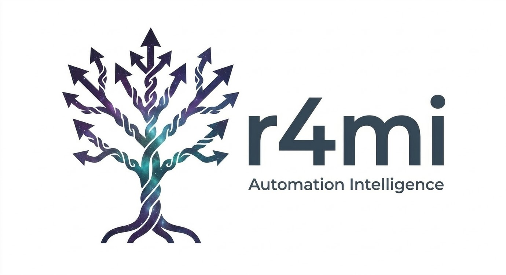

<div align="center">
  
  <h1>r4mi</h1>
  <strong>UI Workflow Observation and Automation Factory</strong>
</div>

---

r4mi sits alongside workers inside information intake systems — permit offices, case management tools, licensing portals — watching how work actually gets done. When it detects that a worker is repeating the same sequence of lookups, decisions, and form fills, it quietly surfaces the pattern and offers to collaborate on building a narrow AI agent that can take over that workflow. The worker stays in control throughout. The agent earns autonomy by proving itself.

**The core loop:**
1. r4mi observes passively. Workers never stop working.
2. Real AI embeddings detect repetition across sessions.
3. The worker reviews the observed sequence and confirms what they want automated.
4. A real LLM builds an executable agent spec — shaped by corrections and domain knowledge the worker provides.
5. The agent is published to an internal marketplace, auto-matches future cases, and runs under supervision until trusted.

---

## The Design Philosophy: Narrow, Transparent, Composable

Most AI automation efforts fail for the same reason: they ask workers to stop, describe their expertise in the abstract, and hand it over to a system they don't control. r4mi inverts this entirely.

**Human-in-the-loop that costs nothing.**
Workers never step outside their normal day to configure or train anything. r4mi watches them work, then at the right moment surfaces a confirmation panel: *"We noticed you've done this 3 times. Is this the sequence? Is this where you were looking for information?"* The worker spends thirty seconds confirming what they already know — not explaining it from scratch, not filling out a training form, not sitting in a workflow documentation session. The AI already watched it happen. They just confirm.

**Narrow by design.**
Each agent does exactly one thing. Not "handle residential permit applications" — more like "check fence-variance zoning rules for R-2 lots and pre-fill height limits from the PDF policy document." This narrowness is the whole point. A narrow agent is trustworthy because its behavior is auditable. It's composable because it fits cleanly under or beside other narrow agents. And it degrades gracefully — if a case is outside scope, it doesn't act.

**Composability through Agentverse.**
Once an agent is published, it becomes a building block. Another worker — or anyone in the network — can take that agent, fork it, tune it for their jurisdiction or edge case, and re-publish it. Every fork tracks its lineage. Attribution is preserved at every level of the stack: who built the original, who refined it, how much of the downstream value derives from each contribution. Workers don't just automate their own repetitive work — they codify domain expertise that compounds across an entire network of people facing the same problems.

**The economic layer (coming).**
The contribution graph that Agentverse tracks today is the foundation for a smart contract-based incentive system. When an organization pays to use r4mi's agent network, the value flows back to the contributors whose agents are doing the work — proportional to usage, traceable to the fork chain. A permit technician in Portland who built the original fence-variance agent earns passive income when an equivalent workflow runs in a different city, built on their foundation. Domain expertise, finally, as an asset class.

---

## How the Intelligence Works

The AI calls in r4mi are genuine — not templates, not hardcoded rules.

- **Session trace embeddings** (`text-embedding-004`) — every completed session's action trace is embedded and compared via cosine similarity across prior sessions. Similarity scores are real numbers from real API calls. This is what drives the "repetition detected" signal.
- **Screen vision analysis** (`gemini-2.5-flash`) — when a worker switches screens, a screenshot is sent to Gemini Vision to identify which text regions they're consulting: policy paragraphs, case notes, freetext fields. This is how the system builds a knowledge map of what the worker knows that the system doesn't.
- **Spec generation** (`gemini-2.5-flash` structured output) — confirmed action sequences and knowledge sources are assembled into an executable `NarrowAgentSpec` via a real LLM call. The output is real reasoning, not a template fill.
- **Live correction handling** — when the worker redirects ("use the PDF source, not the wiki"), the correction is appended to the SpecBuilderAgent prompt and the spec is genuinely regenerated.

The CLI Evidence Panel (accessible from the tab bar) streams live backend logs showing every Gemini call, token count, latency, and cosine similarity score as they happen.

Stub data (GIS lookups, code enforcement records, owner registry) is simulated via JSON seed files. The AI calls are genuine.

---

## The Road Ahead

The current implementation targets municipal permit workflows — a domain with high repetition, complex policy lookups, and underserved workers stuck in legacy software. But the underlying observation loop is domain-agnostic.

**The next major milestone: r4mi as a universal web-shell overlay.**

The goal is to make r4mi droppable into any web-based information intake system with zero modification to the host application. A worker opens their existing tool — a CRM, a licensing portal, an insurance intake form, a healthcare eligibility system — and r4mi's overlay activates alongside it, injecting the observation layer, optimization panel, and agent marketplace as a transparent shell around the existing interface.

This means:
- **No integration required on the host side** — r4mi intercepts UI events at the browser layer, not the application layer
- **Universal pattern detection** — the same embedding-based similarity engine works across any domain where workflows repeat
- **Portable agent specs** — agents built in one organization's instance can be shared to a marketplace and adapted by others facing the same workflow
- **Progressive trust everywhere** — the supervised → autonomous → stale lifecycle applies regardless of domain

The vision: a worker at a state DMV, a county health department, or a federal benefits office opens their existing system and r4mi is already there, watching, learning, and quietly building the automation layer their software vendor never built.

---

## Quick Start

### Prerequisites

- Docker and Docker Compose
- A Gemini API key ([get one free at Google AI Studio](https://aistudio.google.com))

### Run with Docker Compose

```bash
cp .env.example .env
# Edit .env — set GEMINI_API_KEY=your_key_here
docker compose up --build
```

| Service   | URL                          |
|-----------|------------------------------|
| Frontend  | http://localhost:3000        |
| Backend   | http://localhost:8000        |
| API docs  | http://localhost:8000/docs   |

---

## Local Development

**Backend:**

```bash
cd backend
python -m venv .venv
source .venv/bin/activate       # Windows: .venv\Scripts\activate
pip install -r requirements.txt
cp ../.env.example ../.env      # set GEMINI_API_KEY
uvicorn main:app --reload --port 8000
```

**Frontend:**

```bash
cd frontend
npm install
npm run dev
# Proxies /api/* to localhost:8000 via Vite dev server
```

---

## Testing

The full integration flow is covered by a Playwright E2E suite. Tests require live servers and a valid Gemini API key — real AI calls are part of what's being validated.

### Install

```bash
cd e2e
npm install
npx playwright install chromium
```

Start servers first (Docker Compose or local dev as above).

### Health Checks — fast, no Gemini

```bash
cd e2e
npx playwright test health
```

Verifies backend is alive, seed data is loaded (9 applications, 2 prior sessions), and the frontend renders the Application Inbox. Runs in ~5 seconds.

### Full Integration Test

```bash
cd e2e
npx playwright test demo
```

Walks through the complete end-to-end flow in a single browser session:

| Step | What it validates |
|------|-------------------|
| 1 — Intake Work        | Worker navigates inbox → GIS lookup → Policy Reference → submits form |
| 2 — Pattern Detection  | Gemini embedding fires; optimization badge appears via SSE (≤45s) |
| 3 — Session Replay     | Observed workflow replays with `from GIS API` / `from PDF §14.3` source tags |
| 4 — Correction         | Worker redirects knowledge source; spec regenerated via Gemini (≤45s) |
| 5 — Publish            | HITL validation → agent published to Agentverse |
| 6 — Automation         | New case opens; published agent auto-fills zone classification and height fields |
| 7 — Agentverse         | Agent card shows trust level (SUPERVISED) and run count |

**Expected duration:** 20–90 seconds depending on Gemini API latency.

### Run a Specific Step

```bash
cd e2e
npx playwright test --grep "Beat 4"
```

### View Failure Report

```bash
cd e2e
npx playwright show-report
```

Failure artifacts (trace, screenshots, video) are captured automatically.

### Interactive UI Mode

```bash
cd e2e
npx playwright test --ui
```

### Watch the Browser

```bash
cd e2e
npx playwright test demo --headed
```

---

## Architecture

See [ARCHITECTURE.md](ARCHITECTURE.md) for design decisions and [WORKFLOWS.md](WORKFLOWS.md) for the 10-stage observation state machine.

```
Browser
  └── React SPA (Vite + TypeScript + Zustand)
        ├── Legacy Permit UI    — mock information intake interface
        ├── Tab Progression Bar — bottom bar, always visible
        ├── Optimization Panel  — surfaces detected patterns and agent status
        └── SSE hook            — receives real-time events from backend

FastAPI Backend
  ├── /api/observe              — receives UIEvent stream
  ├── /api/sse                  — pushes typed events to frontend
  ├── /api/logs                 — streams live Gemini call logs
  ├── /api/agents/*             — agent marketplace endpoints
  └── /api/stubs/*              — GIS, registry, policy (JSON seed files)

AI Layer (google-genai SDK)
  ├── EmbeddingService          — text-embedding-004, cosine similarity
  ├── VisionService             — gemini-2.5-flash Vision, cached per screen
  ├── SpecBuilderAgent          — gemini-2.5-flash structured output
  └── NarrowAgent               — executes published NarrowAgentSpec
```

The system architecture diagram is rendered live at http://localhost:3000/system.

---

## Cloud Deployment

See [DEPLOY.md](DEPLOY.md) for Google Cloud Run deployment instructions and the automated `cloudbuild.yaml` pipeline.

---

## Environment Variables

| Variable | Default | Description |
|----------|---------|-------------|
| `GEMINI_API_KEY` | **required** | Gemini API key from Google AI Studio |
| `GOOGLE_GENAI_USE_VERTEXAI` | `false` | Use Vertex AI instead of AI Studio |
| `DATABASE_URL` | `sqlite:///./r4mi.db` | SQLite path |
| `PATTERN_THRESHOLD` | `3` | Sessions before pattern detection fires |
| `PATTERN_CONFIDENCE_MIN` | `0.85` | Cosine similarity threshold |
| `AGENTVERSE_MATCH_THRESHOLD` | `0.85` | Agent matching threshold for auto-fill |
| `TRUST_PROMOTION_MIN_RUNS` | `10` | Successful runs before SUPERVISED → AUTONOMOUS |
| `TRUST_PROMOTION_MAX_FAILURE_RATE` | `0.05` | Max failure rate to stay AUTONOMOUS |
| `DEMO_SESSION_SEED` | `true` | Pre-load 2 prior sessions on startup |
| `DEMO_USER_ID` | `permit-tech-001` | Hardcoded user ID |
| `VISION_CACHE_TTL` | `300` | Vision API cache TTL in seconds |
